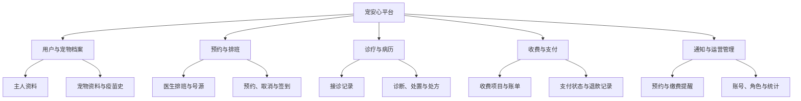
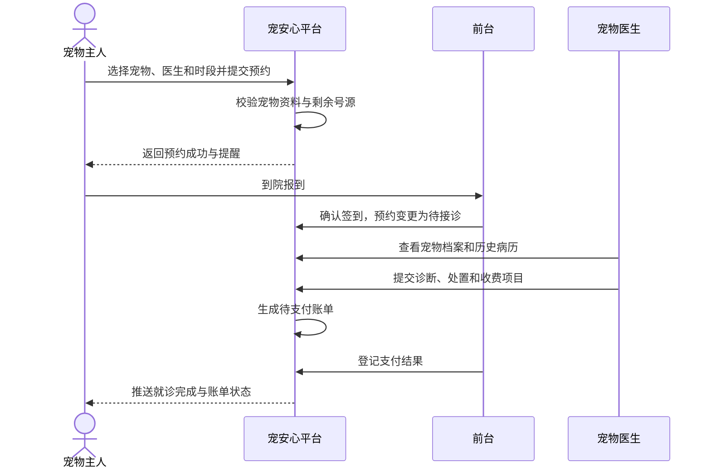

# 宠安心——宠物医院预约与诊疗管理系统

> 面向中小型宠物医院的预约、接诊、病历与收费协同平台。

## 项目简介

“宠安心”是本学期唯一持续演进的微服务课程项目。它围绕宠物从建档、预约就诊、医生接诊、形成病历到收费结算的完整业务闭环，解决小型宠物医院依赖纸质记录、电话预约和分散表格管理时出现的排队不透明、信息易遗漏、病历难追溯等问题。

项目的首个版本聚焦单院区的基础业务协同；后续将按课程进度逐步引入数据库持久化、服务拆分、认证授权、异步消息、分布式事务、可观测性和容器化部署能力。

## 业务背景

随着家庭宠物数量增加，宠物医院需要同时维护主人信息、宠物档案、医生排班、预约队列、诊疗记录与费用明细。传统手工登记或多份独立表格会造成预约冲突、接诊时历史信息缺失、收费项目遗漏，以及主人无法及时获知预约状态等问题。

本项目通过统一的业务平台连接前台、医生和宠物主人：前台能够安排并调整预约，医生能够查看就诊背景并记录诊疗过程，主人能够维护宠物档案、发起预约并查询结果。这样既降低日常运营成本，也为后续扩展药品库存、检验检查和多院区协同预留空间。

## 项目目标与适用场景

| 目标 | 说明 |
| --- | --- |
| 提升预约效率 | 让可预约时段、预约状态和接诊顺序可查询、可调整。 |
| 沉淀诊疗数据 | 将宠物档案、病历、处方和收费记录关联保存，便于后续追溯。 |
| 明确岗位协作 | 为主人、前台、医生和管理员提供与职责匹配的操作入口。 |
| 支撑课程演进 | 从清晰的领域模型出发，逐步实践微服务体系中的关键技术。 |

适用对象为提供门诊、疫苗、驱虫、常规检查等服务的中小型单院区宠物医院；当前不以大型连锁医院、急诊调度或远程诊疗为目标。

## 目标用户与需求

| 角色 | 核心需求 |
| --- | --- |
| 宠物主人 | 注册并维护本人和宠物资料；查看医生可约时段；提交、取消或查看预约；查询诊疗结果和待支付费用。 |
| 前台工作人员 | 管理主人、宠物与医生基础信息；代客预约；确认到院、调整预约状态；生成收费单并登记支付结果。 |
| 宠物医生 | 查看当天接诊列表和宠物历史记录；记录症状、诊断、处置建议与处方；提交完成诊疗的病历。 |
| 系统管理员 | 维护科室、医生、号源与收费项目；管理账号与角色；查看基础运营统计。 |

## 功能设计

| 模块 | 具体功能 |
| --- | --- |
| 用户与宠物档案 | 主人注册与联系方式维护；宠物品种、年龄、过敏史、疫苗史等档案管理；主人与宠物归属关系维护。 |
| 预约与排班 | 医生排班和可预约号源配置；主人自助预约、前台代约、取消与改约；预约状态流转、到院签到和爽约标记。 |
| 诊疗与病历 | 医生查看预约及历史病历；记录主诉、体征、初步诊断、处置建议和处方；病历完成后供主人查询。 |
| 收费与支付 | 按诊疗项目生成账单；记录应收、实收、支付方式和支付状态；支持未支付提醒与退款记录。 |
| 通知与运营管理 | 预约成功、变更、就诊提醒和缴费提醒；账号、角色、医生、科室及收费项目管理；基础预约与营收统计。 |

## 核心业务流程：预约就诊与结算

流程说明：主人先为已建档宠物选择有效号源，系统校验后创建预约；到院后由前台签到，医生完成接诊并提交病历和收费项目；系统据此生成账单，前台确认支付后将本次就诊闭环为“已完成”。后续版本会把关键状态变更以消息方式发送给通知等下游服务。

## 当前范围与暂不实现内容

当前项目以“单院区、常规门诊、人工确认收费”为边界，优先实现宠物档案、预约、接诊病历和账单的基本闭环。

暂不实现：真实第三方支付扣款、药品供应链与库存盘点、检验设备对接、影像文件存储、在线问诊、处方合规审核、急诊分诊及多院区跨店调度。这些内容要么需要外部系统与监管要求，要么会显著扩大首期项目范围，可在基础业务稳定后另行评估。

## 后续演进方向

| 课程主题 | 演进计划 |
| --- | --- |
| 数据库持久化 | 为主人、宠物、排班、预约、病历、账单等核心实体设计关系模型，并补充索引、审计字段和数据初始化。 |
| 认证与授权 | 引入统一身份认证及基于角色的访问控制；主人仅能访问自己的宠物与订单，医生仅能维护自己接诊的病历。 |
| 服务拆分 | 按领域拆分为档案服务、预约服务、诊疗服务、收费服务和通知服务，通过 API 网关统一对外提供能力。 |
| 消息与异步协作 | 使用消息队列发布预约创建、预约取消、诊疗完成和支付完成事件，驱动提醒、统计等异步流程。 |
| 分布式事务 | 对“预约占号”“诊疗完成后生成账单”等跨服务场景设计幂等、补偿与最终一致性方案。 |
| 监控与日志 | 建立统一日志、指标、健康检查和调用链追踪，关注预约成功率、号源使用率、支付成功率和接口延迟。 |
| 部署与交付 | 使用容器化方式部署各服务及依赖组件，补充环境配置、自动化构建与测试，并逐步支持多环境发布。 |

## 选择该题目的原因

宠物医院场景既有清晰的业务主线，又包含多个相互协作的角色和实体。它不像单纯的信息展示系统那样缺少状态变化，也不会像完整电商或大型医院系统那样在第一阶段就引入过多外部依赖。预约、病历、账单等边界天然适合后续服务拆分；号源占用、账单生成和消息提醒也提供了认证、事务和异步通信的真实练习场景，因此适合作为贯穿本学期的持续演进项目。

## 仓库说明

- 课程：微服务课程
- 姓名：请填写姓名
- 学号：2412190531
- 第 2 周作业记录：[docs/homework/week-02/index.md](docs/homework/week-02/index.md)
- `src/`：后续课程代码。
